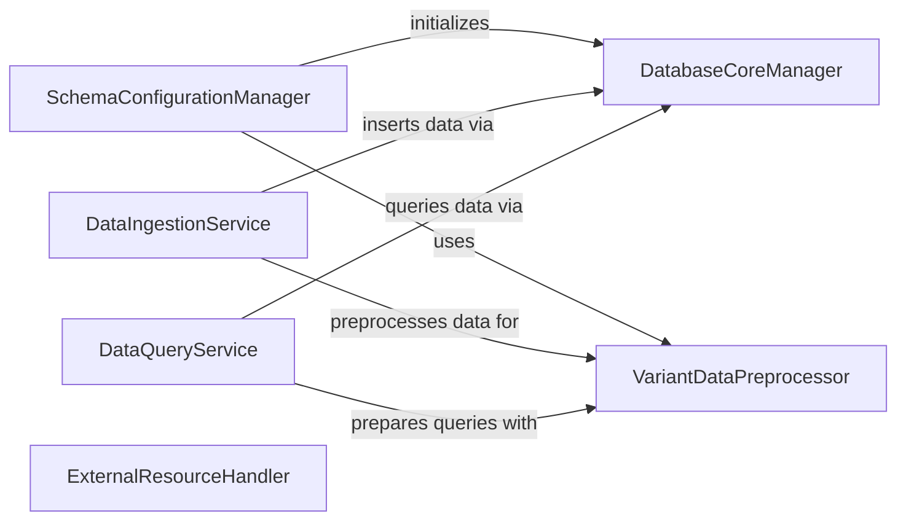

## Component Details

This subsystem provides a comprehensive interface for managing and interacting with a SQLite database storing gnomAD variant data. It handles database initialization, connection management, data ingestion, and various querying functionalities, including data preprocessing and formatting.

### DatabaseCoreManager
This component is responsible for the fundamental operations of the SQLite database, including establishing and managing connections, creating the necessary table structure, and executing direct SQL queries. It acts as the low-level interface for all database interactions.

**Related Classes/Methods**:

- <a href="https://github.com/KalinNonchev/gnomAD_DB/blob/master/gnomad_db/database.py#L42-L43" target="_blank" rel="noopener noreferrer">`gnomad_db.database.gnomAD_DB:open_dbconn` (42:43)</a>
- <a href="https://github.com/KalinNonchev/gnomAD_DB/blob/master/gnomad_db/database.py#L46-L61" target="_blank" rel="noopener noreferrer">`gnomad_db.database.gnomAD_DB:create_table` (46:61)</a>
- <a href="https://github.com/KalinNonchev/gnomAD_DB/blob/master/gnomad_db/database.py#L185-L188" target="_blank" rel="noopener noreferrer">`gnomad_db.database.gnomAD_DB:query_direct` (185:188)</a>

### SchemaConfigurationManager
This component handles the loading and interpretation of the database schema and column definitions from external configuration files (e.g., YAML). It also includes logic for parsing and validating the gnomAD version to ensure compatibility with the defined schema.

**Related Classes/Methods**:

- <a href="https://github.com/KalinNonchev/gnomAD_DB/blob/master/gnomad_db/database.py#L14-L38" target="_blank" rel="noopener noreferrer">`gnomad_db.database.gnomAD_DB:__init__` (14:38)</a>
- <a href="https://github.com/KalinNonchev/gnomAD_DB/blob/master/gnomad_db/database.py#L178-L182" target="_blank" rel="noopener noreferrer">`gnomad_db.database.gnomAD_DB:_parse_gnomad_version` (178:182)</a>

### VariantDataPreprocessor
This component provides a set of utility functions for cleaning, sanitizing, and transforming raw variant data into a format suitable for database insertion or querying. It handles tasks like replacing missing values, converting data types, and parsing variant strings.

**Related Classes/Methods**:

- <a href="https://github.com/KalinNonchev/gnomAD_DB/blob/master/gnomad_db/database.py#L95-L100" target="_blank" rel="noopener noreferrer">`gnomad_db.database.gnomAD_DB:_sanitize_variants` (95:100)</a>
- <a href="https://github.com/KalinNonchev/gnomAD_DB/blob/master/gnomad_db/database.py#L102-L103" target="_blank" rel="noopener noreferrer">`gnomad_db.database.gnomAD_DB:_pack_var_args` (102:103)</a>
- <a href="https://github.com/KalinNonchev/gnomAD_DB/blob/master/gnomad_db/database.py#L170-L176" target="_blank" rel="noopener noreferrer">`gnomad_db.database.gnomAD_DB:_pack_from_str` (170:176)</a>
- <a href="https://github.com/KalinNonchev/gnomAD_DB/blob/master/gnomad_db/database.py#L163-L168" target="_blank" rel="noopener noreferrer">`gnomad_db.database.gnomAD_DB:_query_columns` (163:168)</a>

### DataIngestionService
This component is dedicated to the efficient and structured insertion of variant data into the gnomAD database. It ensures that incoming data conforms to the expected schema and handles the bulk insertion of records.

**Related Classes/Methods**:

- <a href="https://github.com/KalinNonchev/gnomAD_DB/blob/master/gnomad_db/database.py#L63-L93" target="_blank" rel="noopener noreferrer">`gnomad_db.database.gnomAD_DB:insert_variants` (63:93)</a>

### DataQueryService
This component provides comprehensive functionalities for querying and retrieving variant information from the gnomAD database. It supports various query methods, including fetching data based on DataFrames, chromosomal intervals, or string representations of variants, with optional parallel processing.

**Related Classes/Methods**:

- <a href="https://github.com/KalinNonchev/gnomAD_DB/blob/master/gnomad_db/database.py#L105-L138" target="_blank" rel="noopener noreferrer">`gnomad_db.database.gnomAD_DB:_get_info_from_df` (105:138)</a>
- <a href="https://github.com/KalinNonchev/gnomAD_DB/blob/master/gnomad_db/database.py#L142-L159" target="_blank" rel="noopener noreferrer">`gnomad_db.database.gnomAD_DB:get_info_from_df` (142:159)</a>
- <a href="https://github.com/KalinNonchev/gnomAD_DB/blob/master/gnomad_db/database.py#L190-L199" target="_blank" rel="noopener noreferrer">`gnomad_db.database.gnomAD_DB:get_info_for_interval` (190:199)</a>
- <a href="https://github.com/KalinNonchev/gnomAD_DB/blob/master/gnomad_db/database.py#L203-L217" target="_blank" rel="noopener noreferrer">`gnomad_db.database.gnomAD_DB:get_info_from_str` (203:217)</a>

### ExternalResourceHandler
This utility component is responsible for managing external resources, specifically handling the downloading and unzipping of files, which could be used for initial database population or updates.

**Related Classes/Methods**:

- <a href="https://github.com/KalinNonchev/gnomAD_DB/blob/master/gnomad_db/database.py#L221-L225" target="_blank" rel="noopener noreferrer">`gnomad_db.database.gnomAD_DB:download_and_unzip` (221:225)</a>

### [FAQ](https://github.com/CodeBoarding/GeneratedOnBoardings/tree/main?tab=readme-ov-file#faq)