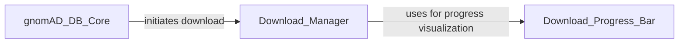

## Component Details

This graph illustrates the components involved in handling external gnomAD data, focusing on download and unzipping functionalities. The `gnomAD_DB_Core` component initiates the data download process, delegating the actual download and unzipping tasks to the `Download_Manager`. The `Download_Manager`, in turn, utilizes the `Download_Progress_Bar` to provide visual feedback during file transfers. The primary purpose is to manage the acquisition and preparation of gnomAD data files for database integration.

### gnomAD_DB_Core
This component represents the core database functionality of gnomAD_DB. It handles the creation, insertion, and retrieval of variant data from an SQLite database. It also manages the database connection and provides methods for querying data based on various criteria, including dataframes, intervals, and string representations of variants. It also includes methods for sanitizing variant data and parsing gnomAD versions. It also provides a static method to initiate the download and unzipping of the gnomAD database file.

**Related Classes/Methods**:

- <a href="https://github.com/KalinNonchev/gnomAD_DB/blob/master/gnomad_db/database.py#L14-L38" target="_blank" rel="noopener noreferrer">`gnomad_db.database.gnomAD_DB:__init__` (14:38)</a>
- <a href="https://github.com/KalinNonchev/gnomAD_DB/blob/master/gnomad_db/database.py#L42-L43" target="_blank" rel="noopener noreferrer">`gnomad_db.database.gnomAD_DB:open_dbconn` (42:43)</a>
- <a href="https://github.com/KalinNonchev/gnomAD_DB/blob/master/gnomad_db/database.py#L46-L61" target="_blank" rel="noopener noreferrer">`gnomad_db.database.gnomAD_DB:create_table` (46:61)</a>
- <a href="https://github.com/KalinNonchev/gnomAD_DB/blob/master/gnomad_db/database.py#L63-L93" target="_blank" rel="noopener noreferrer">`gnomad_db.database.gnomAD_DB:insert_variants` (63:93)</a>
- <a href="https://github.com/KalinNonchev/gnomAD_DB/blob/master/gnomad_db/database.py#L95-L100" target="_blank" rel="noopener noreferrer">`gnomad_db.database.gnomAD_DB:_sanitize_variants` (95:100)</a>
- <a href="https://github.com/KalinNonchev/gnomAD_DB/blob/master/gnomad_db/database.py#L102-L103" target="_blank" rel="noopener noreferrer">`gnomad_db.database.gnomAD_DB:_pack_var_args` (102:103)</a>
- <a href="https://github.com/KalinNonchev/gnomAD_DB/blob/master/gnomad_db/database.py#L105-L138" target="_blank" rel="noopener noreferrer">`gnomad_db.database.gnomAD_DB:_get_info_from_df` (105:138)</a>
- <a href="https://github.com/KalinNonchev/gnomAD_DB/blob/master/gnomad_db/database.py#L142-L159" target="_blank" rel="noopener noreferrer">`gnomad_db.database.gnomAD_DB:get_info_from_df` (142:159)</a>
- <a href="https://github.com/KalinNonchev/gnomAD_DB/blob/master/gnomad_db/database.py#L163-L168" target="_blank" rel="noopener noreferrer">`gnomad_db.database.gnomAD_DB:_query_columns` (163:168)</a>
- <a href="https://github.com/KalinNonchev/gnomAD_DB/blob/master/gnomad_db/database.py#L170-L176" target="_blank" rel="noopener noreferrer">`gnomad_db.database.gnomAD_DB:_pack_from_str` (170:176)</a>
- <a href="https://github.com/KalinNonchev/gnomAD_DB/blob/master/gnomad_db/database.py#L178-L182" target="_blank" rel="noopener noreferrer">`gnomad_db.database.gnomAD_DB:_parse_gnomad_version` (178:182)</a>
- <a href="https://github.com/KalinNonchev/gnomAD_DB/blob/master/gnomad_db/database.py#L185-L188" target="_blank" rel="noopener noreferrer">`gnomad_db.database.gnomAD_DB:query_direct` (185:188)</a>
- <a href="https://github.com/KalinNonchev/gnomAD_DB/blob/master/gnomad_db/database.py#L190-L199" target="_blank" rel="noopener noreferrer">`gnomad_db.database.gnomAD_DB:get_info_for_interval` (190:199)</a>
- <a href="https://github.com/KalinNonchev/gnomAD_DB/blob/master/gnomad_db/database.py#L203-L217" target="_blank" rel="noopener noreferrer">`gnomad_db.database.gnomAD_DB:get_info_from_str` (203:217)</a>
- <a href="https://github.com/KalinNonchev/gnomAD_DB/blob/master/gnomad_db/database.py#L221-L225" target="_blank" rel="noopener noreferrer">`gnomad_db.database.gnomAD_DB:download_and_unzip` (221:225)</a>

### Download_Manager
This component is responsible for orchestrating the downloading and unzipping of files from a given URL to a specified output directory. It utilizes a progress bar for visual feedback during the download process and handles the file operations for unzipping and cleaning up temporary files.

**Related Classes/Methods**:

- <a href="https://github.com/KalinNonchev/gnomAD_DB/blob/master/gnomad_db/utils.py#L16-L20" target="_blank" rel="noopener noreferrer">`gnomad_db.utils:download_url` (16:20)</a>
- <a href="https://github.com/KalinNonchev/gnomAD_DB/blob/master/gnomad_db/utils.py#L22-L30" target="_blank" rel="noopener noreferrer">`gnomad_db.utils:unzip` (22:30)</a>
- <a href="https://github.com/KalinNonchev/gnomAD_DB/blob/master/gnomad_db/utils.py#L32-L37" target="_blank" rel="noopener noreferrer">`gnomad_db.utils:download_and_unzip_file` (32:37)</a>

### Download_Progress_Bar
This component provides a utility for displaying download progress. It extends the `tqdm` library to update the progress bar based on the bytes downloaded, offering visual feedback during file transfers.

**Related Classes/Methods**:

- <a href="https://github.com/KalinNonchev/gnomAD_DB/blob/master/gnomad_db/utils.py#L9-L13" target="_blank" rel="noopener noreferrer">`gnomad_db.utils.DownloadProgressBar` (9:13)</a>

### [FAQ](https://github.com/CodeBoarding/GeneratedOnBoardings/tree/main?tab=readme-ov-file#faq)