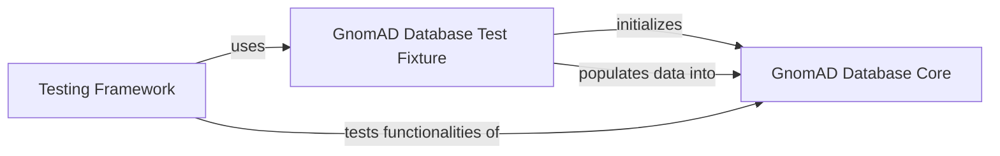

## Component Details

This graph illustrates the interaction between the testing framework and the core database functionalities within the gnomAD_DB project. The Testing Framework relies on a dedicated Test Fixture to set up a consistent test environment, which in turn initializes and populates the GnomAD Database Core. The tests then directly interact with the GnomAD Database Core to verify its data handling and querying capabilities.

### Testing Framework
This component contains the test suite for the gnomAD_DB project. It performs various assertions to verify the correctness of data ingestion, retrieval, and formatting functionalities.

**Related Classes/Methods**:

- <a href="https://github.com/KalinNonchev/gnomAD_DB/blob/master/test_dir/test_gnomad_db.py#L25-L58" target="_blank" rel="noopener noreferrer">`gnomAD_DB.test_dir.test_gnomad_db:test_get_info_from_df` (25:58)</a>
- <a href="https://github.com/KalinNonchev/gnomAD_DB/blob/master/test_dir/test_gnomad_db.py#L63-L91" target="_blank" rel="noopener noreferrer">`gnomAD_DB.test_dir.test_gnomad_db:test_get_info_from_str` (63:91)</a>
- <a href="https://github.com/KalinNonchev/gnomAD_DB/blob/master/test_dir/test_gnomad_db.py#L96-L110" target="_blank" rel="noopener noreferrer">`gnomAD_DB.test_dir.test_gnomad_db:test_insert_variants` (96:110)</a>
- <a href="https://github.com/KalinNonchev/gnomAD_DB/blob/master/test_dir/test_gnomad_db.py#L113-L145" target="_blank" rel="noopener noreferrer">`gnomAD_DB.test_dir.test_gnomad_db:test_query_variants_x320_000_rows` (113:145)</a>
- <a href="https://github.com/KalinNonchev/gnomAD_DB/blob/master/test_dir/test_gnomad_db.py#L149-L155" target="_blank" rel="noopener noreferrer">`gnomAD_DB.test_dir.test_gnomad_db:test_pack_from_str` (149:155)</a>
- <a href="https://github.com/KalinNonchev/gnomAD_DB/blob/master/test_dir/test_gnomad_db.py#L170-L187" target="_blank" rel="noopener noreferrer">`gnomAD_DB.test_dir.test_gnomad_db:test_get_interval_from_str` (170:187)</a>

### GnomAD Database Core
This component encapsulates the core functionalities for interacting with the gnomAD SQLite database. It provides methods for database creation, variant insertion, and various querying mechanisms for retrieving variant information based on different criteria. It also handles data sanitization and parallel processing for queries.

**Related Classes/Methods**:

- <a href="https://github.com/KalinNonchev/gnomAD_DB/blob/master/gnomad_db/database.py#L12-L225" target="_blank" rel="noopener noreferrer">`gnomad_db.database.gnomAD_DB` (12:225)</a>
- <a href="https://github.com/KalinNonchev/gnomAD_DB/blob/master/gnomad_db/database.py#L63-L93" target="_blank" rel="noopener noreferrer">`gnomad_db.database.gnomAD_DB.insert_variants` (63:93)</a>
- <a href="https://github.com/KalinNonchev/gnomAD_DB/blob/master/gnomad_db/database.py#L42-L43" target="_blank" rel="noopener noreferrer">`gnomad_db.database.gnomAD_DB.open_dbconn` (42:43)</a>
- <a href="https://github.com/KalinNonchev/gnomAD_DB/blob/master/gnomad_db/database.py#L46-L61" target="_blank" rel="noopener noreferrer">`gnomad_db.database.gnomAD_DB.create_table` (46:61)</a>
- <a href="https://github.com/KalinNonchev/gnomAD_DB/blob/master/gnomad_db/database.py#L95-L100" target="_blank" rel="noopener noreferrer">`gnomad_db.database.gnomAD_DB._sanitize_variants` (95:100)</a>
- <a href="https://github.com/KalinNonchev/gnomAD_DB/blob/master/gnomad_db/database.py#L102-L103" target="_blank" rel="noopener noreferrer">`gnomad_db.database.gnomAD_DB._pack_var_args` (102:103)</a>
- <a href="https://github.com/KalinNonchev/gnomAD_DB/blob/master/gnomad_db/database.py#L105-L138" target="_blank" rel="noopener noreferrer">`gnomad_db.database.gnomAD_DB._get_info_from_df` (105:138)</a>
- <a href="https://github.com/KalinNonchev/gnomAD_DB/blob/master/gnomad_db/database.py#L142-L159" target="_blank" rel="noopener noreferrer">`gnomad_db.database.gnomAD_DB.get_info_from_df` (142:159)</a>
- <a href="https://github.com/KalinNonchev/gnomAD_DB/blob/master/gnomad_db/database.py#L163-L168" target="_blank" rel="noopener noreferrer">`gnomad_db.database.gnomAD_DB._query_columns` (163:168)</a>
- <a href="https://github.com/KalinNonchev/gnomAD_DB/blob/master/gnomad_db/database.py#L170-L176" target="_blank" rel="noopener noreferrer">`gnomad_db.database.gnomAD_DB._pack_from_str` (170:176)</a>
- <a href="https://github.com/KalinNonchev/gnomAD_DB/blob/master/gnomad_db/database.py#L178-L182" target="_blank" rel="noopener noreferrer">`gnomad_db.database.gnomAD_DB._parse_gnomad_version` (178:182)</a>
- <a href="https://github.com/KalinNonchev/gnomAD_DB/blob/master/gnomad_db/database.py#L185-L188" target="_blank" rel="noopener noreferrer">`gnomad_db.database.gnomAD_DB.query_direct` (185:188)</a>
- <a href="https://github.com/KalinNonchev/gnomAD_DB/blob/master/gnomad_db/database.py#L190-L199" target="_blank" rel="noopener noreferrer">`gnomad_db.database.gnomAD_DB.get_info_for_interval` (190:199)</a>
- <a href="https://github.com/KalinNonchev/gnomAD_DB/blob/master/gnomad_db/database.py#L203-L217" target="_blank" rel="noopener noreferrer">`gnomad_db.database.gnomAD_DB.get_info_from_str` (203:217)</a>
- <a href="https://github.com/KalinNonchev/gnomAD_DB/blob/master/gnomad_db/database.py#L221-L225" target="_blank" rel="noopener noreferrer">`gnomad_db.database.gnomAD_DB.download_and_unzip` (221:225)</a>

### GnomAD Database Test Fixture
This component is a pytest fixture responsible for setting up and populating a test instance of the gnomAD database. It reads configuration, initializes the GnomAD Database Core component, and inserts a predefined set of test variants into the database, ensuring a consistent state for subsequent tests.

**Related Classes/Methods**:

- <a href="https://github.com/KalinNonchev/gnomAD_DB/blob/master/test_dir/test_gnomad_db.py#L8-L21" target="_blank" rel="noopener noreferrer">`gnomAD_DB.test_dir.test_gnomad_db:database` (8:21)</a>

### [FAQ](https://github.com/CodeBoarding/GeneratedOnBoardings/tree/main?tab=readme-ov-file#faq)