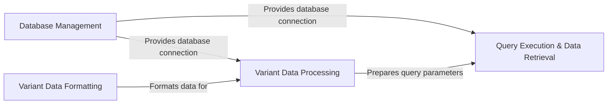

## Component Details

This architecture overview describes the key components of the gnomAD database interaction system. It details how the database is managed, how variant data is formatted and processed for consistency, and how queries are executed to retrieve information, highlighting the flow of data and control between these distinct functional areas.

### Database Management
This component is responsible for the fundamental operations of the gnomAD database, including its initialization, connection handling, and table creation. It ensures the database structure is correctly set up and accessible for data operations.

**Related Classes/Methods**:

- <a href="https://github.com/KalinNonchev/gnomAD_DB/blob/master/gnomad_db/database.py#L14-L38" target="_blank" rel="noopener noreferrer">`gnomad_db.database.gnomAD_DB:__init__` (14:38)</a>
- <a href="https://github.com/KalinNonchev/gnomAD_DB/blob/master/gnomad_db/database.py#L46-L61" target="_blank" rel="noopener noreferrer">`gnomad_db.database.gnomAD_DB.create_table` (46:61)</a>
- <a href="https://github.com/KalinNonchev/gnomAD_DB/blob/master/gnomad_db/database.py#L42-L43" target="_blank" rel="noopener noreferrer">`gnomad_db.database.gnomAD_DB.open_dbconn` (42:43)</a>
- <a href="https://github.com/KalinNonchev/gnomAD_DB/blob/master/gnomad_db/database.py#L178-L182" target="_blank" rel="noopener noreferrer">`gnomad_db.database.gnomAD_DB._parse_gnomad_version` (178:182)</a>

### Variant Data Formatting
This component provides helper functions for parsing and packing variant data from various input formats (e.g., string, pandas Series) into a consistent structure suitable for database operations. It also handles gnomAD version parsing and validation.

**Related Classes/Methods**:

- <a href="https://github.com/KalinNonchev/gnomAD_DB/blob/master/gnomad_db/database.py#L102-L103" target="_blank" rel="noopener noreferrer">`gnomAD_DB.gnomad_db.database.gnomAD_DB._pack_var_args` (102:103)</a>
- <a href="https://github.com/KalinNonchev/gnomAD_DB/blob/master/gnomad_db/database.py#L170-L176" target="_blank" rel="noopener noreferrer">`gnomAD_DB.gnomad_db.database.gnomAD_DB._pack_from_str` (170:176)</a>
- <a href="https://github.com/KalinNonchev/gnomAD_DB/blob/master/gnomad_db/database.py#L178-L182" target="_blank" rel="noopener noreferrer">`gnomAD_DB.gnomad_db.database.gnomAD_DB._parse_gnomad_version` (178:182)</a>

### Variant Data Processing
This component handles the preparation and sanitization of variant data before it is used in database queries or insertions. It ensures data consistency and proper formatting for interaction with the database.

**Related Classes/Methods**:

- <a href="https://github.com/KalinNonchev/gnomAD_DB/blob/master/gnomad_db/database.py#L95-L100" target="_blank" rel="noopener noreferrer">`gnomad_db.database.gnomAD_DB._sanitize_variants` (95:100)</a>
- <a href="https://github.com/KalinNonchev/gnomAD_DB/blob/master/gnomad_db/database.py#L102-L103" target="_blank" rel="noopener noreferrer">`gnomad_db.database.gnomAD_DB._pack_var_args` (102:103)</a>
- <a href="https://github.com/KalinNonchev/gnomAD_DB/blob/master/gnomad_db/database.py#L170-L176" target="_blank" rel="noopener noreferrer">`gnomad_db.database.gnomAD_DB._pack_from_str` (170:176)</a>
- <a href="https://github.com/KalinNonchev/gnomAD_DB/blob/master/gnomad_db/database.py#L63-L93" target="_blank" rel="noopener noreferrer">`gnomad_db.database.gnomAD_DB.insert_variants` (63:93)</a>

### Query Execution & Data Retrieval
This component is responsible for constructing and executing SQL queries against the gnomAD database and retrieving the results. It provides interfaces for querying based on dataframes, strings, or direct SQL commands.

**Related Classes/Methods**:

- <a href="https://github.com/KalinNonchev/gnomAD_DB/blob/master/gnomad_db/database.py#L105-L138" target="_blank" rel="noopener noreferrer">`gnomad_db.database.gnomAD_DB._get_info_from_df` (105:138)</a>
- <a href="https://github.com/KalinNonchev/gnomAD_DB/blob/master/gnomad_db/database.py#L203-L217" target="_blank" rel="noopener noreferrer">`gnomad_db.database.gnomAD_DB.get_info_from_str` (203:217)</a>
- <a href="https://github.com/KalinNonchev/gnomAD_DB/blob/master/gnomad_db/database.py#L163-L168" target="_blank" rel="noopener noreferrer">`gnomad_db.database.gnomAD_DB._query_columns` (163:168)</a>
- <a href="https://github.com/KalinNonchev/gnomAD_DB/blob/master/gnomad_db/database.py#L185-L188" target="_blank" rel="noopener noreferrer">`gnomad_db.database.gnomAD_DB.query_direct` (185:188)</a>
- <a href="https://github.com/KalinNonchev/gnomAD_DB/blob/master/gnomad_db/database.py#L142-L159" target="_blank" rel="noopener noreferrer">`gnomad_db.database.gnomAD_DB.get_info_from_df` (142:159)</a>
- <a href="https://github.com/KalinNonchev/gnomAD_DB/blob/master/gnomad_db/database.py#L190-L199" target="_blank" rel="noopener noreferrer">`gnomad_db.database.gnomAD_DB.get_info_for_interval` (190:199)</a>

### [FAQ](https://github.com/CodeBoarding/GeneratedOnBoardings/tree/main?tab=readme-ov-file#faq)