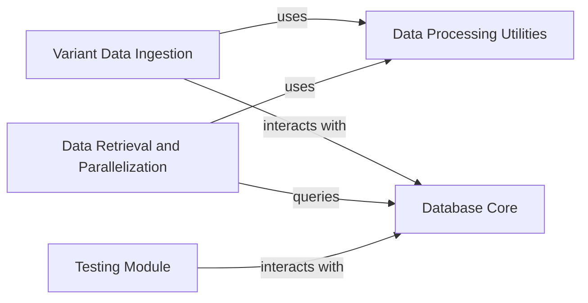

## Component Details

This system manages the processing, storage, and retrieval of gnomAD variant data. It provides core database functionalities, utilities for data preparation, and mechanisms for efficient data access, including parallel processing, ensuring data integrity and performance.

### Variant Data Ingestion
This component is responsible for processing and inserting variant data into the gnomAD database. It includes methods for sanitizing input dataframes to ensure they conform to the expected format before storage.

**Related Classes/Methods**:

- <a href="https://github.com/KalinNonchev/gnomAD_DB/blob/master/gnomad_db/database.py#L63-L93" target="_blank" rel="noopener noreferrer">`gnomAD_DB.gnomad_db.database.gnomAD_DB:insert_variants` (63:93)</a>
- <a href="https://github.com/KalinNonchev/gnomAD_DB/blob/master/gnomad_db/database.py#L95-L100" target="_blank" rel="noopener noreferrer">`gnomAD_DB.gnomad_db.database.gnomAD_DB._sanitize_variants` (95:100)</a>

### Database Core
Manages the SQLite database connection, table creation, and direct data insertion and retrieval operations. It provides the fundamental interface for interacting with the gnomAD database.

**Related Classes/Methods**:

- <a href="https://github.com/KalinNonchev/gnomAD_DB/blob/master/gnomad_db/database.py#L12-L225" target="_blank" rel="noopener noreferrer">`gnomAD_DB.gnomad_db.database.gnomAD_DB` (12:225)</a>
- <a href="https://github.com/KalinNonchev/gnomAD_DB/blob/master/gnomad_db/database.py#L42-L43" target="_blank" rel="noopener noreferrer">`gnomAD_DB.gnomad_db.database.gnomAD_DB.open_dbconn` (42:43)</a>
- <a href="https://github.com/KalinNonchev/gnomAD_DB/blob/master/gnomad_db/database.py#L46-L61" target="_blank" rel="noopener noreferrer">`gnomAD_DB.gnomad_db.database.gnomAD_DB.create_table` (46:61)</a>
- <a href="https://github.com/KalinNonchev/gnomAD_DB/blob/master/gnomad_db/database.py#L185-L188" target="_blank" rel="noopener noreferrer">`gnomAD_DB.gnomad_db.database.gnomAD_DB.query_direct` (185:188)</a>
- <a href="https://github.com/KalinNonchev/gnomAD_DB/blob/master/gnomad_db/database.py#L190-L199" target="_blank" rel="noopener noreferrer">`gnomAD_DB.gnomad_db.database.gnomAD_DB.get_info_for_interval` (190:199)</a>
- <a href="https://github.com/KalinNonchev/gnomAD_DB/blob/master/gnomad_db/database.py#L203-L217" target="_blank" rel="noopener noreferrer">`gnomAD_DB.gnomad_db.database.gnomAD_DB.get_info_from_str` (203:217)</a>

### Data Processing Utilities
Provides utility functions for sanitizing variant data, packing arguments for database queries, and formatting query columns. These functions ensure data consistency and proper formatting before database interactions.

**Related Classes/Methods**:

- <a href="https://github.com/KalinNonchev/gnomAD_DB/blob/master/gnomad_db/database.py#L95-L100" target="_blank" rel="noopener noreferrer">`gnomAD_DB.gnomad_db.database.gnomAD_DB._sanitize_variants` (95:100)</a>
- <a href="https://github.com/KalinNonchev/gnomAD_DB/blob/master/gnomad_db/database.py#L102-L103" target="_blank" rel="noopener noreferrer">`gnomAD_DB.gnomad_db.database.gnomAD_DB._pack_var_args` (102:103)</a>
- <a href="https://github.com/KalinNonchev/gnomAD_DB/blob/master/gnomad_db/database.py#L163-L168" target="_blank" rel="noopener noreferrer">`gnomAD_DB.gnomad_db.database.gnomAD_DB._query_columns` (163:168)</a>
- <a href="https://github.com/KalinNonchev/gnomAD_DB/blob/master/gnomad_db/database.py#L170-L176" target="_blank" rel="noopener noreferrer">`gnomAD_DB.gnomad_db.database.gnomAD_DB._pack_from_str` (170:176)</a>
- <a href="https://github.com/KalinNonchev/gnomAD_DB/blob/master/gnomad_db/database.py#L178-L182" target="_blank" rel="noopener noreferrer">`gnomAD_DB.gnomad_db.database.gnomAD_DB._parse_gnomad_version` (178:182)</a>

### Data Retrieval and Parallelization
Handles the retrieval of gnomAD information from dataframes, including logic for parallel processing of queries to improve performance for large datasets. It orchestrates the use of data processing utilities and the database core for efficient data access.

**Related Classes/Methods**:

- <a href="https://github.com/KalinNonchev/gnomAD_DB/blob/master/gnomad_db/database.py#L105-L138" target="_blank" rel="noopener noreferrer">`gnomAD_DB.gnomad_db.database.gnomAD_DB._get_info_from_df` (105:138)</a>
- <a href="https://github.com/KalinNonchev/gnomAD_DB/blob/master/gnomad_db/database.py#L142-L159" target="_blank" rel="noopener noreferrer">`gnomAD_DB.gnomad_db.database.gnomAD_DB.get_info_from_df` (142:159)</a>

### Testing Module
Contains test cases and setup for verifying the functionality of the gnomAD database interactions.

**Related Classes/Methods**:

- <a href="https://github.com/KalinNonchev/gnomAD_DB/blob/master/test_dir/test_gnomad_db.py#L8-L21" target="_blank" rel="noopener noreferrer">`gnomAD_DB.test_dir.test_gnomad_db:database` (8:21)</a>

### [FAQ](https://github.com/CodeBoarding/GeneratedOnBoardings/tree/main?tab=readme-ov-file#faq)