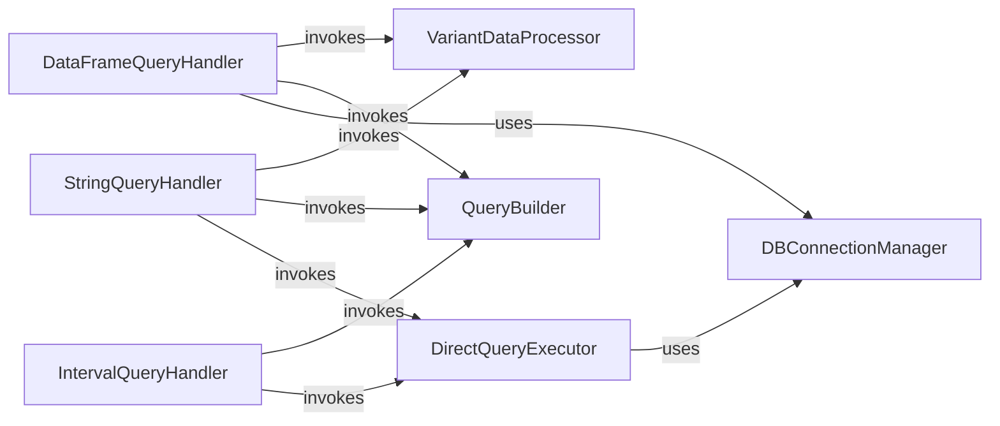

## Component Details

This system provides a robust interface for querying gnomAD variant data. It allows users to retrieve variant information using various input formats, including pandas DataFrames, genomic intervals, and string representations of variants. The system manages database connections, sanitizes input data, constructs SQL queries, and executes them, with support for parallel processing for large DataFrame queries.

### DBConnectionManager
This component is responsible for establishing and managing connections to the SQLite database. It provides the core functionality to open a database connection for various operations.

**Related Classes/Methods**:

- <a href="https://github.com/KalinNonchev/gnomAD_DB/blob/master/gnomad_db/database.py#L42-L43" target="_blank" rel="noopener noreferrer">`gnomAD_DB.gnomad_db.database.gnomAD_DB.open_dbconn` (42:43)</a>

### VariantDataProcessor
This component handles the preparation and sanitization of variant data. It ensures that variant information from different input formats (DataFrame or string) is correctly formatted and packed for database queries.

**Related Classes/Methods**:

- <a href="https://github.com/KalinNonchev/gnomAD_DB/blob/master/gnomad_db/database.py#L95-L100" target="_blank" rel="noopener noreferrer">`gnomAD_DB.gnomad_db.database.gnomAD_DB._sanitize_variants` (95:100)</a>
- <a href="https://github.com/KalinNonchev/gnomAD_DB/blob/master/gnomad_db/database.py#L102-L103" target="_blank" rel="noopener noreferrer">`gnomAD_DB.gnomad_db.database.gnomAD_DB._pack_var_args` (102:103)</a>
- <a href="https://github.com/KalinNonchev/gnomAD_DB/blob/master/gnomad_db/database.py#L170-L176" target="_blank" rel="noopener noreferrer">`gnomAD_DB.gnomad_db.database.gnomAD_DB._pack_from_str` (170:176)</a>

### QueryBuilder
The QueryBuilder component is responsible for constructing the appropriate SQL query strings, specifically for selecting columns based on the user's request or default settings.

**Related Classes/Methods**:

- <a href="https://github.com/KalinNonchev/gnomAD_DB/blob/master/gnomad_db/database.py#L163-L168" target="_blank" rel="noopener noreferrer">`gnomAD_DB.gnomad_db.database.gnomAD_DB._query_columns` (163:168)</a>

### DataFrameQueryHandler
This component manages the retrieval of gnomAD information when the input is a pandas DataFrame of variants. It orchestrates data sanitization, packing, query building, and database interaction, potentially utilizing parallel processing.

**Related Classes/Methods**:

- <a href="https://github.com/KalinNonchev/gnomAD_DB/blob/master/gnomad_db/database.py#L105-L138" target="_blank" rel="noopener noreferrer">`gnomAD_DB.gnomad_db.database.gnomAD_DB._get_info_from_df` (105:138)</a>
- <a href="https://github.com/KalinNonchev/gnomAD_DB/blob/master/gnomad_db/database.py#L142-L159" target="_blank" rel="noopener noreferrer">`gnomAD_DB.gnomad_db.database.gnomAD_DB.get_info_from_df` (142:159)</a>

### DirectQueryExecutor
This component provides a direct interface for executing arbitrary SQL queries against the gnomAD database and returning the results, typically as a pandas DataFrame.

**Related Classes/Methods**:

- <a href="https://github.com/KalinNonchev/gnomAD_DB/blob/master/gnomad_db/database.py#L185-L188" target="_blank" rel="noopener noreferrer">`gnomAD_DB.gnomad_db.database.gnomAD_DB.query_direct` (185:188)</a>

### IntervalQueryHandler
This component specializes in retrieving gnomAD information for a specified genomic interval (chromosome, start, and end positions). It uses the QueryBuilder and DirectQueryExecutor to perform its function.

**Related Classes/Methods**:

- <a href="https://github.com/KalinNonchev/gnomAD_DB/blob/master/gnomad_db/database.py#L190-L199" target="_blank" rel="noopener noreferrer">`gnomAD_DB.gnomad_db.database.gnomAD_DB.get_info_for_interval` (190:199)</a>

### StringQueryHandler
This component handles the retrieval of gnomAD information for a single variant provided as a string (e.g., 'chr:pos:ref>alt'). It relies on the VariantDataProcessor, QueryBuilder, and DirectQueryExecutor.

**Related Classes/Methods**:

- <a href="https://github.com/KalinNonchev/gnomAD_DB/blob/master/gnomad_db/database.py#L203-L217" target="_blank" rel="noopener noreferrer">`gnomAD_DB.gnomad_db.database.gnomAD_DB.get_info_from_str` (203:217)</a>

### [FAQ](https://github.com/CodeBoarding/GeneratedOnBoardings/tree/main?tab=readme-ov-file#faq)