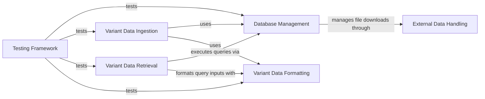

## Component Details

This graph represents the architecture of the `gnomAD_DB` project, which is designed to manage and query gnomAD variant data. The main flow involves handling external gnomAD data files, ingesting them into an SQLite database, and providing various interfaces for retrieving variant information. A dedicated testing framework ensures the integrity and functionality of all core components.

### Database Management
This component encapsulates the core SQLite database functionalities. It is responsible for establishing and managing database connections, creating the necessary table structure, and executing direct SQL queries. It serves as the low-level interface for all database interactions.

**Related Classes/Methods**:

- <a href="https://github.com/KalinNonchev/gnomAD_DB/blob/master/gnomad_db/database.py#L14-L38" target="_blank" rel="noopener noreferrer">`gnomAD_DB.gnomad_db.database.gnomAD_DB:__init__` (14:38)</a>
- <a href="https://github.com/KalinNonchev/gnomAD_DB/blob/master/gnomad_db/database.py#L42-L43" target="_blank" rel="noopener noreferrer">`gnomAD_DB.gnomad_db.database.gnomAD_DB:open_dbconn` (42:43)</a>
- <a href="https://github.com/KalinNonchev/gnomAD_DB/blob/master/gnomad_db/database.py#L46-L61" target="_blank" rel="noopener noreferrer">`gnomAD_DB.gnomad_db.database.gnomAD_DB:create_table` (46:61)</a>
- <a href="https://github.com/KalinNonchev/gnomAD_DB/blob/master/gnomad_db/database.py#L185-L188" target="_blank" rel="noopener noreferrer">`gnomAD_DB.gnomad_db.database.gnomAD_DB:query_direct` (185:188)</a>

### Variant Data Ingestion
This component is responsible for processing and inserting variant data into the gnomAD database. It includes methods for sanitizing input dataframes to ensure they conform to the expected format before storage.

**Related Classes/Methods**:

- <a href="https://github.com/KalinNonchev/gnomAD_DB/blob/master/gnomad_db/database.py#L63-L93" target="_blank" rel="noopener noreferrer">`gnomAD_DB.gnomad_db.database.gnomAD_DB:insert_variants` (63:93)</a>
- <a href="https://github.com/KalinNonchev/gnomAD_DB/blob/master/gnomad_db/database.py#L95-L100" target="_blank" rel="noopener noreferrer">`gnomAD_DB.gnomad_db.database.gnomAD_DB._sanitize_variants` (95:100)</a>

### Variant Data Retrieval
This component provides various interfaces for querying variant information from the gnomAD database. It supports querying by DataFrame, genomic interval, or a string representation of a variant, and can handle parallel processing for large queries.

**Related Classes/Methods**:

- <a href="https://github.com/KalinNonchev/gnomAD_DB/blob/master/gnomad_db/database.py#L105-L138" target="_blank" rel="noopener noreferrer">`gnomAD_DB.gnomad_db.database.gnomAD_DB._get_info_from_df` (105:138)</a>
- <a href="https://github.com/KalinNonchev/gnomAD_DB/blob/master/gnomad_db/database.py#L142-L159" target="_blank" rel="noopener noreferrer">`gnomAD_DB.gnomad_db.database.gnomAD_DB:get_info_from_df` (142:159)</a>
- <a href="https://github.com/KalinNonchev/gnomAD_DB/blob/master/gnomad_db/database.py#L190-L199" target="_blank" rel="noopener noreferrer">`gnomAD_DB.gnomad_db.database.gnomAD_DB:get_info_for_interval` (190:199)</a>
- <a href="https://github.com/KalinNonchev/gnomAD_DB/blob/master/gnomad_db/database.py#L203-L217" target="_blank" rel="noopener noreferrer">`gnomAD_DB.gnomad_db.database.gnomAD_DB:get_info_from_str` (203:217)</a>
- <a href="https://github.com/KalinNonchev/gnomAD_DB/blob/master/gnomad_db/database.py#L163-L168" target="_blank" rel="noopener noreferrer">`gnomAD_DB.gnomad_db.database.gnomAD_DB._query_columns` (163:168)</a>

### Variant Data Formatting
This component provides helper functions for parsing and packing variant data from various input formats (e.g., string, pandas Series) into a consistent structure suitable for database operations. It also handles gnomAD version parsing and validation.

**Related Classes/Methods**:

- <a href="https://github.com/KalinNonchev/gnomAD_DB/blob/master/gnomad_db/database.py#L102-L103" target="_blank" rel="noopener noreferrer">`gnomAD_DB.gnomad_db.database.gnomAD_DB._pack_var_args` (102:103)</a>
- <a href="https://github.com/KalinNonchev/gnomAD_DB/blob/master/gnomad_db/database.py#L170-L176" target="_blank" rel="noopener noreferrer">`gnomAD_DB.gnomad_db.database.gnomAD_DB._pack_from_str` (170:176)</a>
- <a href="https://github.com/KalinNonchev/gnomAD_DB/blob/master/gnomad_db/database.py#L178-L182" target="_blank" rel="noopener noreferrer">`gnomAD_DB.gnomad_db.database.gnomAD_DB._parse_gnomad_version` (178:182)</a>

### External Data Handling
This component manages the downloading and unzipping of gnomAD data files from external URLs. It includes utilities for displaying download progress and handling file extraction.

**Related Classes/Methods**:

- <a href="https://github.com/KalinNonchev/gnomAD_DB/blob/master/gnomad_db/database.py#L221-L225" target="_blank" rel="noopener noreferrer">`gnomAD_DB.gnomad_db.database.gnomAD_DB.download_and_unzip` (221:225)</a>
- <a href="https://github.com/KalinNonchev/gnomAD_DB/blob/master/gnomad_db/utils.py#L32-L37" target="_blank" rel="noopener noreferrer">`gnomAD_DB.gnomad_db.utils:download_and_unzip_file` (32:37)</a>
- <a href="https://github.com/KalinNonchev/gnomAD_DB/blob/master/gnomad_db/utils.py#L16-L20" target="_blank" rel="noopener noreferrer">`gnomAD_DB.gnomad_db.utils:download_url` (16:20)</a>
- <a href="https://github.com/KalinNonchev/gnomAD_DB/blob/master/gnomad_db/utils.py#L22-L30" target="_blank" rel="noopener noreferrer">`gnomAD_DB.gnomad_db.utils.unzip` (22:30)</a>
- <a href="https://github.com/KalinNonchev/gnomAD_DB/blob/master/gnomad_db/utils.py#L9-L13" target="_blank" rel="noopener noreferrer">`gnomAD_DB.gnomad_db.utils.DownloadProgressBar` (9:13)</a>

### Testing Framework
This component contains the test suite for the gnomAD_DB project. It sets up a test database instance, loads sample data, and performs various assertions to verify the correctness of data ingestion, retrieval, and formatting functionalities.

**Related Classes/Methods**:

- <a href="https://github.com/KalinNonchev/gnomAD_DB/blob/master/test_dir/test_gnomad_db.py#L8-L21" target="_blank" rel="noopener noreferrer">`gnomAD_DB.test_dir.test_gnomad_db:database` (8:21)</a>
- <a href="https://github.com/KalinNonchev/gnomAD_DB/blob/master/test_dir/test_gnomad_db.py#L25-L58" target="_blank" rel="noopener noreferrer">`gnomAD_DB.test_dir.test_gnomad_db:test_get_info_from_df` (25:58)</a>
- <a href="https://github.com/KalinNonchev/gnomAD_DB/blob/master/test_dir/test_gnomad_db.py#L63-L91" target="_blank" rel="noopener noreferrer">`gnomAD_DB.test_dir.test_gnomad_db:test_get_info_from_str` (63:91)</a>
- <a href="https://github.com/KalinNonchev/gnomAD_DB/blob/master/test_dir/test_gnomad_db.py#L96-L110" target="_blank" rel="noopener noreferrer">`gnomAD_DB.test_dir.test_gnomad_db:test_insert_variants` (96:110)</a>
- <a href="https://github.com/KalinNonchev/gnomAD_DB/blob/master/test_dir/test_gnomad_db.py#L113-L145" target="_blank" rel="noopener noreferrer">`gnomAD_DB.test_dir.test_gnomad_db:test_query_variants_x320_000_rows` (113:145)</a>
- <a href="https://github.com/KalinNonchev/gnomAD_DB/blob/master/test_dir/test_gnomad_db.py#L149-L155" target="_blank" rel="noopener noreferrer">`gnomAD_DB.test_dir.test_gnomad_db:test_pack_from_str` (149:155)</a>
- <a href="https://github.com/KalinNonchev/gnomAD_DB/blob/master/test_dir/test_gnomad_db.py#L170-L187" target="_blank" rel="noopener noreferrer">`gnomAD_DB.test_dir.test_gnomad_db:test_get_interval_from_str` (170:187)</a>

### [FAQ](https://github.com/CodeBoarding/GeneratedOnBoardings/tree/main?tab=readme-ov-file#faq)